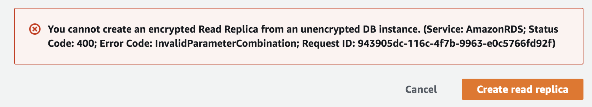
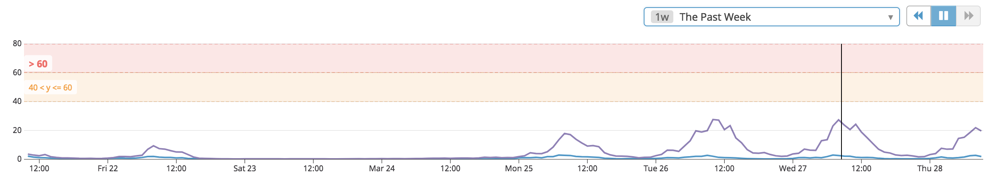

# Enable RDS Encryption At Rest For Existing Instance

During this year's SOC-2 Audit, we received an urgent requirement that all of our production databases had to have **Encryption At Rest** enabled.  The deadline was set to 1 week.  Our quick inventory check revealed that we had 10 MySQL database instances hosted on AWS RDS to encrypt and 3 of them were replicas.  To make matters worse, one of these DBs was our monolith database cluster supporting majority of our customers.  And as you can imagine with a monolith database - there are a lot of legacy services that connect to it, which makes a proposion of making a test-clone of the entire environment practically impossible.  Which meant we had to do get the process 100% right the first time around, or risk loosing data.  Needless to say - this put a high amount of pressure on our team (Data Services).

Armed with this information we jumped on a call with our security team, and made an analogy, that what we are attempting to do here is like swapping foundation from underneath a skyscraper while the tenants are still inside.  Sure, we are running on AWS RDS, and they give us the heavy "*earth moving*" equipment for majority of the work we need to do, but it still requires very careful, surgical precision to execute and not miss any details.  This made the right impression and we had our deadline extened to 2 weeks.  

What follows is the story of how we got this done on time, first go, and with zero data loss.

## Options

There are a number of important details you have to get right to enable Encryption At Rest on an **existing** RDS MySQL instance, but before delving into these details, lets answer some common questions:

Why can't you simply enable Encryption At Rest on an existing instance by turning the **Encryption Enabled** switch to `ON`?  Here's what AWS documetation has to say about that:

> You can only enable encryption for an Amazon RDS DB instance when you create it, not after the DB instance is created.
>
> However, because you can encrypt a copy of an unencrypted DB snapshot, you can effectively add encryption to an unencrypted DB instance. That is, you can create a snapshot of your DB instance, and then create an encrypted copy of that snapshot. You can then restore a DB instance from the encrypted snapshot, and thus you have an encrypted copy of your original DB instance.

REF: [Encryption.Limitations](https://docs.aws.amazon.com/AmazonRDS/latest/UserGuide/Overview.Encryption.html#Overview.Encryption.Limitations)

You also cannot create an encrypted Read Replica from an unencrypted DB instance:

> You cannot create an encrypted Read Replica from an unencrypted DB instance. (Service: AmazonRDS; Status Code:
>
>  400; Error Code: InvalidParameterCombination; Request ID: 943905dc-116c-4f7b-9963-e0c5766fd92f)



What's the solution then?  There are at least two methods to enable Encryption At Rest for an existing RDS instance:

1. **Limited Downtime**: encrypting and promoting a read replica
2. **Complete Downtime**: cold backup / restore approach

We picked **cold backup / restore approach** due to it's lower complexity to develop proper automation and because our SLA permits a [scheduled downtime](https://status.invisionapp.com/incidents/fsf3sf9ydfvp) on the weekends.  However, both methods share the same important step: *restoring an RDS Instance from an encrypted snapshot*.  The only difference is that method 1) uses the snapshot of the read-replica and method 2) the snapshot of the master/primary itself.

And there are some important gaps in the [AWS RDS API RestoreDBInstanceFromDBSnapshot](https://docs.aws.amazon.com/AmazonRDS/latest/APIReference/API_RestoreDBInstanceFromDBSnapshot.html) that have to be filled with proper automation which we'll delve into in this blog post.  But before getting there, lets go over the high level process overview of the **cold backup / restore approach** we went through.

## Cold Backup / Restore Approach

1. [Enable site wide maintenance](https://status.invisionapp.com/incidents/fsf3sf9ydfvp)
2. Shutdown all services
3. Shutdown analytics processes
4. Rename the databases with `old-` prefix
5. Bounce the databases to clear any connections
6. Verify no connections exist
7. Take an RDS snapshot across all databases
8. Encrypt snapshots
9. Restore encrypted snapshots with `new-` prefix
10. Recreate replicas and analytics users and setup
11. Rename all newly encrypted instances and their replicas back to their original names
12. Restart all services
13. Restart/validate analytics processes
14. Validate functionality
15. Disable site wide maintenance

The interesting bits are in steps 9 and 10 and that's what we'll focus on next.

## Restore Encrypted Snapshots

There are some important gaps in the [AWS RDS API RestoreDBInstanceFromDBSnapshot](https://docs.aws.amazon.com/AmazonRDS/latest/APIReference/API_RestoreDBInstanceFromDBSnapshot.html) that have to be filled with proper automation.  Our infrustructure automation language of choice is [Go](https://golang.org/) so we'll use [real snippets of code](https://github.com/InVisionApp/ds-blog/tree/master/blog/DS-1311/code) from our tooling to go over these gaps.

In order to restore an RDS instance from an encrypted snapshot we construct an API call and copy the following parameters directly from the source instance:

```go
type Instance struct {
	Name                  string
	MultiAZ               bool
	Engine                string
	EngineVersion         string
	DBInstanceClass       string
	AllocatedStorage      int64
	NewDBInstanceClass    string
	Status                string
	ParGroupName          string
	ParGroupStatus        string
	PreferredBackupWindow string
	BackupRetentionPeriod int64
	RDSDBInstance         *rds.DBInstance
	TagList               []*rds.Tag
	DB                    *sql.DB
}
...
...
...
func (s *SDK) RestoreInstance(sorceInstance Instance, takeFreshSnap bool, kmsKeyID string, np *NameParser) (Instance, error) {
	targetName := np.NewName(sorceInstance.Name)
	dbParGroupName := sorceInstance.RDSDBInstance.DBParameterGroups[0].DBParameterGroupName
	vpcSecurityGroups := sorceInstance.FilterVPCSecurityGroups(Active)
...
...
	snapInput := &rds.RestoreDBInstanceFromDBSnapshotInput{
		AutoMinorVersionUpgrade: sorceInstance.RDSDBInstance.AutoMinorVersionUpgrade,
		CopyTagsToSnapshot:          sorceInstance.RDSDBInstance.CopyTagsToSnapshot,
		DBInstanceClass:             sorceInstance.RDSDBInstance.DBInstanceClass,
		DBInstanceIdentifier:        aws.String(targetName),
		DBSnapshotIdentifier:        snap.DBSnapshotIdentifier,
		DBSubnetGroupName:           sorceInstance.RDSDBInstance.DBSubnetGroup.DBSubnetGroupName,
		Iops:                        sorceInstance.RDSDBInstance.Iops,
		MultiAZ:                     sorceInstance.RDSDBInstance.MultiAZ,
		EnableCloudwatchLogsExports: sorceInstance.RDSDBInstance.EnabledCloudwatchLogsExports,
		OptionGroupName:             sorceInstance.RDSDBInstance.OptionGroupMemberships[0].OptionGroupName,
		PubliclyAccessible:          sorceInstance.RDSDBInstance.PubliclyAccessible,
		StorageType:                 sorceInstance.RDSDBInstance.StorageType,
		Tags:                        sorceInstance.TagList,
	}
	if !*sorceInstance.RDSDBInstance.MultiAZ {
		snapInput.AvailabilityZone = sorceInstance.RDSDBInstance.AvailabilityZone
	}
	if _, err := s.svc.RestoreDBInstanceFromDBSnapshotWithContext(s.ctx, snapInput); err != nil {
		return Instance{}, fmt.Errorf("ERROR: RestoreDBInstanceFromDBSnapshotWithContext(%s) failed with: %v", *snap.DBSnapshotIdentifier, err)
	}

	return s.ModifyInstance(targetName, *dbParGroupName, vpcSecurityGroups)
```

Note that:

1. <u>if not supplied</u>, `MultiAZ`, `OptionGroupName` and `DBSubnetGroupName` will default to values that won't match the source instance
2. to match `DBParameterGroupName` and `VpcSecurityGroupIds` we have to call a [ModifyDBInstance API](https://docs.aws.amazon.com/AmazonRDS/latest/APIReference/API_ModifyDBInstance.html) - there is no way to do this during restore itself:

```go
func (s *SDK) ModifyInstance(instanceName, dbParGroupName string, vpcSecurityGroups []*string) (Instance, error) {
	readyFunc := func(i Instance) bool {
		ok := i.Status == Available
		if !ok {
			s.log.Printf("... ModifyInstance: [%24s] waiting for DB status to change from %q to %q", i.Name, i.Status, Available)
		}
		return ok
	}

	if err := s.waitForDBStatus(instanceName, readyFunc); err != nil {
		return Instance{}, err
	}

	// check if the groupName is already set to what we want
	i, err := s.Describe(instanceName)
	if err != nil {
		return Instance{}, err
	}

	// the only way it can be set to dbParGroupName is if we already modified it,
	// and in this case we can make an educated guess that the DBSecurityGroups is also
	// set to the right value so we are not even checking it here
	if *i.RDSDBInstance.DBParameterGroups[0].DBParameterGroupName == dbParGroupName {
		s.log.Printf("... ModifyInstance: [%24s] DBParameterGroupName is already set to %q", instanceName, dbParGroupName)
		return i, nil
	}

	pp := func(a []*string) string {
		r := ""
		for _, v := range a {
			r += *v + " "
		}
		return strings.TrimSpace(r)
	}

	s.log.Printf("... ModifyInstance: [%24s] Updating DBParameterGroupName to: %q and SecurityGroups to: %q", instanceName, dbParGroupName, pp(vpcSecurityGroups))
	if _, err := s.svc.ModifyDBInstanceWithContext(s.ctx, &rds.ModifyDBInstanceInput{
		DBInstanceIdentifier: aws.String(instanceName),
		ApplyImmediately:     aws.Bool(true),
		DBParameterGroupName: aws.String(dbParGroupName),
		VpcSecurityGroupIds:  vpcSecurityGroups,
	}); err != nil {
		return Instance{}, err
	}

	if err := s.waitForDBStatus(instanceName, readyFunc); err != nil {
		return Instance{}, err
	}

	// DB instance has to be bounced now, but we need to wait until
	// parameter group status == pending-reboot before doing so ...
	readyFunc2 := func(i Instance) bool {
		ok := i.ParGroupStatus == pendingReboot
		if !ok {
			s.log.Printf("... ModifyInstance: [%24s] waiting for %s group status change, want: %s got: %s", instanceName, dbParGroupName, pendingReboot, i.ParGroupStatus)
		}
		return ok
	}
	if err := s.waitForDBStatus(instanceName, readyFunc2); err != nil {
		return Instance{}, err
	}

	// reboot (no failover as per doc)
	s.log.Printf("... ModifyInstance: [%24s] Rebooting, for DBParameterGroupName %q to take effect", instanceName, dbParGroupName)
	if err := s.Reboot(instanceName, false); err != nil {
		return Instance{}, err
	}

	if err := s.waitForDBStatus(instanceName, readyFunc); err != nil {
		return Instance{}, err
	}

	return s.Describe(instanceName)
}
```

In the code snippet above, we are calling `waitForDBStatus` twice: the first pass is to ensure the newly restored instance is in `Available` state before doing any changes, and the second time to wait for the reboot to happen before returning back to the caller.  The reboot is needed for `DBParameterGroupName` change to take effect.  If you need the code for `waitForDBStatus`, it's available here: [waitForDBStatus source code](https://github.com/InVisionApp/ds-blog/blob/master/blog/DS-1311/code/wait_for_dbstatus.go)

## Recreate Read Replicas
At this point, the instance is restored from the encrypted snapshot and all if it's attributes match the source instance it's replacing (we'll go over how to validate this in the following section).  The next step is to recreate all of it's read-replicas if any exist.  This task can require substantial custom automation depending on how these read-replicas were originally setup.  For example, we had to redo and automate the following:

1. re-create any DB users that were created directly on the original replica
2. re-set [binlog retention hours](https://docs.aws.amazon.com/AmazonRDS/latest/UserGuide/mysql_rds_show_configuration.html) that were configured on the original replica

Lets go over these in order:

```go
func (s *SDK) reCreateReplica(master, copyFrom Instance, name string, binlogRetention int, rootPass string) error {
	for _, replica := range master.RDSDBInstance.ReadReplicaDBInstanceIdentifiers {
		if *replica == name {
			s.log.Printf("... reCreateReplica: [%24s] %q replica already exists", master.Name, name)
			return s.reCreateReplicaFinalize(master, copyFrom, name, binlogRetention, rootPass)
		}
	}

	replicaInput := &rds.CreateDBInstanceReadReplicaInput{
		AutoMinorVersionUpgrade: copyFrom.RDSDBInstance.AutoMinorVersionUpgrade,
		// AvailabilityZone:            copyFrom.RDSDBInstance.AvailabilityZone,
		CopyTagsToSnapshot:   copyFrom.RDSDBInstance.CopyTagsToSnapshot,
		DBInstanceClass:      copyFrom.RDSDBInstance.DBInstanceClass,
		DBInstanceIdentifier: aws.String(name),
		// DBSubnetGroupNotAllowedFault: DbSubnetGroupName should not be specified for read replicas that are created in the same region as the master
		// DBSubnetGroupName:           copyFrom.RDSDBInstance.DBSubnetGroup.DBSubnetGroupName,
		EnableCloudwatchLogsExports: copyFrom.RDSDBInstance.EnabledCloudwatchLogsExports,
		EnablePerformanceInsights:   copyFrom.RDSDBInstance.PerformanceInsightsEnabled,
		Iops:                        copyFrom.RDSDBInstance.Iops,
		KmsKeyId:                    copyFrom.RDSDBInstance.KmsKeyId,
		MonitoringInterval:          copyFrom.RDSDBInstance.MonitoringInterval,
		MonitoringRoleArn:           copyFrom.RDSDBInstance.MonitoringRoleArn,
		MultiAZ:                     copyFrom.RDSDBInstance.MultiAZ,
		OptionGroupName:             copyFrom.RDSDBInstance.OptionGroupMemberships[0].OptionGroupName,
		PerformanceInsightsKMSKeyId: copyFrom.RDSDBInstance.PerformanceInsightsKMSKeyId,
		PubliclyAccessible:         copyFrom.RDSDBInstance.PubliclyAccessible,
		SourceDBInstanceIdentifier: master.RDSDBInstance.DBInstanceIdentifier,
		StorageType:                copyFrom.RDSDBInstance.StorageType,
		Tags:                       copyFrom.TagList}
	if !*copyFrom.RDSDBInstance.MultiAZ {
		replicaInput.AvailabilityZone = copyFrom.RDSDBInstance.AvailabilityZone
	}
	if *copyFrom.RDSDBInstance.DbInstancePort > 0 {
		replicaInput.Port = copyFrom.RDSDBInstance.DbInstancePort
	}

	s.log.Printf("... reCreateReplica: [%24s] creating %q replica based on %q", master.Name, name, copyFrom.Name)
	if _, err := s.svc.CreateDBInstanceReadReplicaWithContext(s.ctx, replicaInput); err != nil {
		return err
	}

	return s.reCreateReplicaFinalize(master, copyFrom, name, binlogRetention, rootPass)
}
```
The code snippet above is similar to the *restore instance from snapshot* we did earlier, we are simply looping over all existing read-replicas that exist on the source instance and re-creating them with the same attributes by calling [CreateDBInstanceReadReplica API](https://docs.aws.amazon.com/goto/WebAPI/rds-2014-10-31/CreateDBInstanceReadReplica).  Then, before returning back to caller, we finalize the replica's AWS attributes and DB's internals (users and replication parameters) to match it's souce by calling `reCreateReplicaFinalize`:

```go
func (s *SDK) reCreateReplicaFinalize(master, copyFrom Instance, name string, binlogRetention int, rootPass string) error {
	groupName := copyFrom.RDSDBInstance.DBParameterGroups[0].DBParameterGroupName
	newReplica, err := s.ModifyInstance(name, *groupName, copyFrom.FilterVPCSecurityGroups(Active))
	if err != nil {
		return err
	}
	return s.cloneReplica(master, copyFrom, newReplica, binlogRetention, rootPass)
}
```

which first calls `ModifyInstance` [routine](https://github.com/InVisionApp/ds-blog/blob/master/blog/DS-1311/code/modify_instance.go) we went over earlier and then `cloneReplica`:

```go
func (s *SDK) cloneReplica(master, copyFrom, newReplica Instance, binlogRetention int, rootPass string) error {
	// for now only support mysql
	if newReplica.Engine != "mysql" {
		return nil
	}

	rc := &mysqlReplicaClone{
		copyFrom:     copyFrom,
		copyTo:       newReplica,
		rootPass:     rootPass,
		binlogRetHrs: aws.Int(binlogRetention),
		log:          s.log,
	}
	dryRun := false
	return rc.execute(s.Verbose, dryRun)
}
```
where `mysqlReplicaClone.execute` does all of the heavy lifting to match DB's internals, the code for which is available in [mysql_replica_clone.go](https://github.com/InVisionApp/ds-blog/blob/master/blog/DS-1311/code/mysql_replica_clone.go).  The goal of this clone process is to take a list of DB users from source replica instance and compare it with the target and re-create any missing users and their grants.  Here's how this works:

- after making [connections](https://github.com/InVisionApp/ds-blog/blob/master/blog/DS-1311/code/mysql_replica_clone.go#L94-L102) to source and target instances, we gather the users and their grants on both source and target instances using `dumpQuery` function [here](https://github.com/InVisionApp/ds-blog/blob/master/blog/DS-1311/code/mysql_replica_clone.go#L104-L119)
- [dumpQuery](https://github.com/InVisionApp/ds-blog/blob/master/blog/DS-1311/code/mysql_replica_clone.go#L246-L324)'s job is to turn MySQL table rows into Go's `map` with it's **key** comprised of *concatenated primary key values* and it's **value** being the entire row represented as `map` with *column names as keys and column values as pointer values*.  For example, suppose the table is:

```
PK1 	PK2 	COL1	COL2
-----	-----	-----	-----
p1A 	p2A 	c1A 	c2A
p1B 	p2B 	c1B 	c2B
p1C 	p2C 	c1C 	NULL
```

then the resulting Go's map structure is as follows:

```
[p1A|p2A]{
  [PK1]*p1A
  [PK2]*p2A
  [COL1]*c1A
  [COL2]*c2A
}
[p1B|p2B]{
  [PK1]*p1B
  [PK2]*p2B
  [COL1]*c1B
  [COL2]*c2B
}
[p1C|p2C]{
  [PK1]*p1C
  [PK2]*p2C
  [COL1]*c1C
  [COL2]*<nil>
}
```

having this data structure allows us to lookup any row by it's primary key and then lookup each column by it's name.  This is very powerful.

* at this point we have our source and target users and all of the source schema level grants, we now compare the list of users and if the user is missing on the target - we re-create it and it's schema level grants (if any) [here](https://github.com/InVisionApp/ds-blog/blob/master/blog/DS-1311/code/mysql_replica_clone.go#L133-L170)
* and as a final step we reset the [binlog retention hours](https://github.com/InVisionApp/ds-blog/blob/master/blog/DS-1311/code/mysql_replica_clone.go#L172) to a static value we always use (7 days)

## Validation
At this point, all newly restored instances with encryption at rest enabled, and it's read-replicas (if any), are ready and named as `new-<nameN>`.  

Our original instances are renamed as `old-<nameN>` to ensure no connections can be made to them.  

Before we rename the `new*` to their "real" names, we have to validate that the AWS RDS Attributes match across the board.  And for this task, we'll use python because it has a very powerful [difflib](https://docs.python.org/3/library/difflib.html) Standard Library:

```python
import boto3
import difflib
import pprint


rds = boto3.client('rds', region_name='us-east-1')


def check_instances(instance_pair):
    i1 = instance_pair[0]
    i2 = instance_pair[1]
    if i1 == i2:
        return
    print("###\n####\n##### %s vs %s #####\n####\n###" % (i1, i2))
    resp_a = rds.describe_db_instances(DBInstanceIdentifier=i1)
    resp_b = rds.describe_db_instances(DBInstanceIdentifier=i2)
    diff = difflib.ndiff(
        pprint.pformat(resp_a['DBInstances'][0]).splitlines(keepends=True),
        pprint.pformat(resp_b['DBInstances'][0]).splitlines(keepends=True))
    print(''.join(diff))


instances = [
    ("old-prod-one", "new-old-prod-one"),
    ("old-prod-one-replica", "new-old-prod-one-replica"),
    ("old-prod-one-replica2", "new-old-prod-one-replica2"),
    ("old-prod-two", "new-old-prod-two"),
    ("old-prod-three", "new-old-prod-three"),
    ("old-prod-three-replica", "new-old-prod-three-replica"),
]

for instance_pair in instances:
    check_instances(instance_pair)
```

to run validation you simply execute the above script and use `grep` to filter the differences:

```bash
python compare_instances.py | egrep "^#|^\+"
```

and if the differences are what you expect, simply rename the `new-*` instances to their original names using AWS CLI:

```bash
aws rds modify-db-instance --db-instance-identifier new-old-prod-one           --new-db-instance-identifier prod-one --apply-immediately
aws rds modify-db-instance --db-instance-identifier new-old-prod-one-replica   --new-db-instance-identifier prod-one-replica --apply-immediately
aws rds modify-db-instance --db-instance-identifier new-old-prod-one-replica2  --new-db-instance-identifier prod-one-replica2 --apply-immediately
aws rds modify-db-instance --db-instance-identifier new-old-prod-two           --new-db-instance-identifier prod-two --apply-immediately
aws rds modify-db-instance --db-instance-identifier new-old-prod-three         --new-db-instance-identifier prod-three --apply-immediately
aws rds modify-db-instance --db-instance-identifier new-old-prod-three-replica --new-db-instance-identifier prod-three-replica --apply-immediately
```

**TIP**: you don't have to wait for the master rename to complete before executing the replica rename.

## Lessons Learned

Our production deployment worked as expected because we rehearsed it 3 times ahead of time so there would be no surprises.  However, there were a couple of things we learned after the fact that you might find useful:

1. There is a slight increase in R/W latency after enabling Encryption At Rest - our slow query monitor picked that up on the first business morning, right after migration (see graph below).
2. The read replicas we recreated served as the source for Analytics Change Data Capture process and this tooling didn't support the change in MySQL binlog replication log offset so it had to go through a full resync.



## Conclusion

With careful planning, automation and rehearsals it's entirely possible to enable KMS Encryption At Rest on a large number of existing RDS Instances.  And there are a few options to choose from (online vs cold).  It would be a lot simpler if AWS RDS supported enabling KMS Encryption on existing instances out of the box, but as of Mar 23 2019 it didn't — at least not on our version of MySQL - 5.6.x.